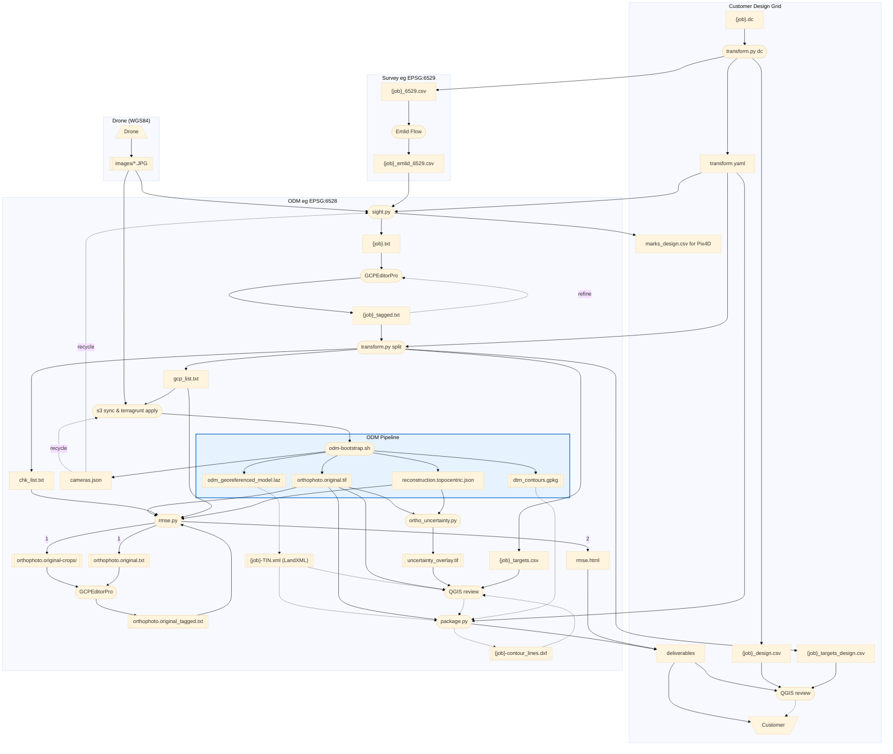

# ODM Workflow for Drone Surveys

---

## Overview


### Edge Notes

Dotted edges signify a) recycled or iterative (eg cameras.json and {job}\_tagged.txt), b) decision (eg QGIS review before package.py or customer delivery), or c) not done yet (tin and contours).

---

## CRS notes

The tools do not assume multiple CRS, but do flexibly handle them if needed, often automatically.  Subgraphs in the workflow diagram show a sample multi-CRS flow, here are some related comments.

| CRS | Use | Notes |
|-----|-----|-------|
| **EPSG:6528** (NAD83(2011) NM Central, metres) | ODM control + RMSE check files | Metric counterpart of the survey CRS — auto-derived |
| **EPSG:6529** (NAD83(2011) NM Central, ftUS) | Field survey, Emlid native output, internal analysis | Convert to metric (6528) before ODM |

**Note on EPSG:3618 vs 6529:** Both are NAD83 NM Central in US survey feet for the same zone.
The difference is the realization year (1986 vs 2011); horizontal coordinates differ by only
a fraction of a foot regionally and are interchangeable for this workflow.  We use 6529
throughout because it is the Emlid native output.

**Why a metric CRS for ODM?**  EPSG:6529 is 2D — it defines XY units (US survey
feet) but not vertical units.  ODM assumes Z is in metres for any 2D CRS,
causing a ~3.28× Z scale error when Z is in feet.  Switching to the **metric
counterpart of the survey CRS** (e.g. 6529 ftUS → 6528 m) is unambiguous —
all axes in metres — while keeping the projection unchanged so there is no
horizontal reprojection step and no UTM grid-convergence/scale-factor
contribution to RMSE.  `transform.py dc` derives this automatically by
stripping the `(ftUS)` suffix from the auto-detected delivery CRS name and
re-resolving via pyproj; the result is written to `transform.yaml` as
`odm_crs` and consumed by `sight.py` and `transform.py split`.  When the
survey CRS is already metric or no metric counterpart exists, it falls back
to EPSG:32613 (UTM 13N).

---

## Workflow step-by-step

### 1. Obtain control monument coordinates

You need control monument coordinates in the appropriate CRS (eg EPSG:6529) before going to the field.

**Customer/Trimble jobs**: Customer provides a `.dc` data collector file with design-grid
coordinates. `transform.py dc` converts them to state plane and writes
`{job}_6529.csv`, `{job}_design.csv`, and `transform.yaml`:

```bash
# Default: auto-query the NGS API to identify anchor monuments and compute the shift.
conda run -n geo python transform.py dc \
    {job}/{customer}_{job}.dc \
    --out-dir {job}/
# → {job}/{job}_6529.csv    (state-plane EPSG:6529, for Emlid localization)
# → {job}/{job}_design.csv  (design-grid coords, for QGIS design review)
# → {job}/transform.yaml    (CRS + shift params; used downstream)

# Manual override (when NGS auto-lookup fails or you need higher accuracy than the
# lat/lon-derived fallback ±20 ft):
conda run -n geo python transform.py dc \
    {job}/"F100340 AZTEC.dc" \
    --anchor 14 1147722.527 2144275.554 \
    --out-dir {job}/
```

**How the anchor is identified:**

`transform.py dc` first tries the NGS API automatically — for any control monument in
the `.dc` file described as an NGS benchmark (e.g. "NGS VCM 3D Y 430"), it queries the
NGS datasheet database, retrieves the official state-plane coordinates, and computes the
design-grid shift.  When multiple NGS anchors are present, the script cross-checks them
and prints how closely they agree (typically within a fraction of a foot).  For most
jobs no manual lookup is needed.

If auto-lookup fails (no NGS-described monuments in the file, or the API returns no
matches), the script prints the monument table — flagging NGS candidates with `← NGS` —
and exits.  In that case:

1. Search the NGS datasheet database (https://www.ngs.noaa.gov/datasheets/) by monument
   description or by lat/lon near the project site.
2. Read the state-plane E/N in **US survey feet** from the datasheet.
3. Re-run with `--anchor <id> <state_E_ft> <state_N_ft>`.

You may also use `--anchor` to override the API result when you need tighter accuracy
than the API's lat/lon-derived fallback (~±20 ft) provides.

The shift is saved in `transform.yaml` for consistent reuse downstream.  It only needs to be
computed once per job (same `.dc` file = same design grid = same shift).

**Other jobs**: obtain monument coordinates in appropriate CRS directly from the surveyor.

Use `{job}_6529.csv` for Emlid RS3 base/rover localization in the field.

> **Before proceeding:** manually prune `{job}_6529.csv` (or the Emlid survey CSV)
> to remove any rows you do not want flowing through the pipeline — e.g. base-setup
> shots, observations from prior site visits, monuments not relevant to this job, or
> duplicate entries.  Every row that remains will become a candidate target in
> GCPEditorPro.  It is easiest to prune here, in a familiar spreadsheet format,
> before the data is transformed and projected.

### 2. Build tagging file

```bash
conda run -n geo python TargetSighter/sight.py \
    {job}/{job}_emlid_6529.csv \
    {job}/images/
# If transform.yaml is present in {job}/, sight.py auto-loads it:
#   field_crs → used as fallback CRS for the survey CSV
#   odm_crs   → target CRS for {job}.txt (metric counterpart of survey CRS, e.g. EPSG:6528)
#   job name  → used as output filename ({job}.txt)
# Without transform.yaml, pass explicitly: --crs EPSG:XXXX --out-name "{job}"
# → {job}/{job}.txt         (all survey points, ODM metric CRS, for GCPEditorPro)
# → {job}/marks_design.csv  (Pix4D parallel workflow — not used in ODM path)
```

By default, sight.py names the ten most-dispersed targets as GCP and the remainder as CHK, then ranks the targets and their images by tagging value — tagging in order produces the best accuracy for the least effort. Near-duplicate targets (within `--dup-tolerance` metres of another, default 1 m) inherit the role of their closest primary and get a `-dup` suffix (`GCP-104-dup`, `CHK-119-dup2`, ...), and are placed immediately after their primary in the file so they can be reviewed side-by-side. Target names are **recommendations** — the user has final say on role assignment in GCPEditorPro (step 3).

**How sight.py orders targets** — the sequence is designed to lock down the
model's geometry as quickly as possible with the fewest tags:

| Order | GCP selected as | Why first |
|-------|-----------------|-----------|
| 1st | Most distal from centroid | Sets one anchor of the bounding box |
| 2nd | Most distal from #1 | Defines global scale and orientation |
| 3rd | Highest elevation *(hilly sites only)* | Prevents vertical drift upward |
| 4th | Lowest elevation *(hilly sites only)* | Prevents vertical drift downward |
| 5th | Closest to centroid | Anti-doming center pin |
| 6th–10th | Remaining, perimeter-first | Redundancy — strongest structural value |
| 11th+ | Remaining, interior-first | Become CHK- check points |

Z-priority slots (3rd and 4th) activate only when the site's elevation range
exceeds 5 % of the horizontal span (`--z-threshold`).  Flat sites skip from
2nd directly to the center pin.

Within each target, **images are sorted by confidence** — well-centred shots
(less lens distortion) before edge shots, with nadir and oblique images
interleaved so that the first 7 contain both nadir coverage (accurate X/Y) and
oblique coverage (parallax for accurate Z).  Use `--nadir-weight` to tune how
aggressively obliques are promoted (default 0.2; higher values push obliques
later in the list).

**Common sight.py flags:**

| Flag | Effect |
|------|--------|
| `--no-sort` | Output targets in input CSV order, images in match order (let upstream control ordering) |
| `--no-coloredX` | Disable Stage-3 color-based marker refinement (runs by default; needs cv2/numpy) |
| `--n-control 7` | How many top targets become GCP- (default 10) |
| `--z-threshold 0.02` | Lower threshold to activate Z-priority slots on modest terrain (default 0.05) |
| `--nadir-weight 0.4` | Tune oblique/nadir interleaving (0 = treat equally, 1 = all nadir first; default 0.2) |
| `--reconstruction path/to/reconstruction.json` | Use SfM-refined camera poses for ±5–20 px estimates instead of EXIF-only ±30–150 px (requires a prior ODM run) |

### 3. Tag in GCPEditorPro

This step uses a [GCPEditorPro fork](https://github.com/jrstear/GCPEditorPro/tree/feature/auto-gcp-pipeline)
with pipeline-aware features (zoom view, spacebar confirm, progress badges,
compass/tilt overlays, etc.). The full list of modifications relative to
upstream uav4geo/GCPEditorPro lives in the fork itself:
[`CHANGES-fork.md`](https://github.com/jrstear/GCPEditorPro/blob/feature/auto-gcp-pipeline/CHANGES-fork.md).

1. Open GCPEditorPro.  Running from source (this fork on
   `feature/auto-gcp-pipeline`) requires the OpenSSL legacy provider:
   ```bash
   cd ~/git/GCPEditorPro && NODE_OPTIONS=--openssl-legacy-provider npm start
   ```
   The app opens at <http://localhost:4200>.
2. Load **`{job}.txt`** and the images directory
3. Review GCP- and CHK- points, tag pixel observations
   - GCP- labels = ground control (given to ODM to georeference the reconstruction)
   - CHK- labels = independent check points (withheld from ODM; used for accuracy QC only)
   - You may reassign labels between GCP- and CHK- roles as needed (select in target list, then toggle the Checkpoint checkbox).
4. Go to next step → Download → saves as **`{job}_tagged.txt`**
   - All rows are exported (tagged and untagged)

**Tagging targets (USGS / ASPRS):**

| Requirement | Minimum | Target |
|---|---|---|
| GCP- control points confirmed | 3 | **7** (of 10 candidates) |
| CHK- check points confirmed | 3 | **7** |
| Confirmed images per GCP-/CHK- point | 3 | **7** |

The minimums are hard floors from the *USGS National Geospatial Program — Lidar
Base Specification* and *ASPRS Positional Accuracy Standards for Digital
Geospatial Data (2015)*; both specify ≥ 3 independent check points for
publishable accuracy reporting.  The "target 7" values match the green-badge
threshold in GCPEditorPro's progress indicators.  Work top-to-bottom through
the list — sight.py's ordering means the first 7 give the best structural
coverage for the least effort.

### 4. Split into purpose-specific files

```bash
conda run -n geo python transform.py split \
    {job}/{job}_tagged.txt \
    --out-dir {job}/
# Reads {job}/transform.yaml automatically (uses odm_crs from it, e.g. EPSG:6528)
# → {job}/gcp_list.txt            (GCP- tagged tuples, ODM metric CRS; for ODM)
# → {job}/chk_list.txt            (CHK- tagged tuples, ODM metric CRS; for rmse.py)
# → {job}/{job}_targets.csv       (one row/target, ODM metric CRS; for QGIS review)
# → {job}/{job}_targets_design.csv (one row/target, design-grid; for customer QGIS)
```

**`{job}_targets.csv`** is the primary QGIS QC layer: one row per surveyed target,
tagged targets labeled `GCP-NNN` or `CHK-NNN`, untagged targets labeled with bare
monument ID.  Load as a point layer over the orthophoto to verify target placement.

### 4.5. Pre-ODM tag-quality check (recommended)

```bash
conda run -n geo python check_tags.py \
    {job}/{job}.txt \
    {job}/{job}_tagged.txt \
    --report {job}/check_tags.tsv
```

`check_tags.py` compares the user's confirmed pixel tags against
sight.py's color-refined estimates and ranks targets by suspicion — a
catastrophic mistake (e.g. user clicked a base station instead of the
target, as happened with CHK-14 and CHK-18 in the aztec7 study) lands
near the top of the list above the default `--gate-score 0.7`. The
script exits non-zero if any target exceeds the gate, so it can be
wired into an orchestration guard before launching ODM.

The detector ignores projection-source tags' pixel offsets (which are
expected to be 50–200 px from estimate due to per-camera EXIF noise)
and focuses on disagreement among `color`/`tri_color` tags. Two distinct
flag patterns appear:

- **Few or no anchors with high consensus offset**: sight.py's color
  refinement found the wrong feature; the user is tagging correctly
  but disagrees with the estimate. Review confirms tags are right.
- **Anchors plus high-residual outlier tags**: a subset of tags
  diverge from the consensus — likely the catastrophic-mistagging case.

See `docs/plans/tag-quality-consistency.md` for algorithm details and
validation results.

### 5. Launch ODM on EC2

Each job gets its own per-job EC2 stack via the Terragrunt template at
`infra/terragrunt/ec2/`, so multiple ODM jobs can run concurrently without
resource-name collisions or state-file overlap (see geo-elmk).

```bash
# Upload images (one-time; skip if already in S3)
aws s3 sync {job}/images/ \
    s3://{BUCKET}/{job}/images/

# Upload control file
aws s3 cp {job}/gcp_list.txt \
    s3://{BUCKET}/{job}/gcp_list.txt

# Materialize the per-job terragrunt dir + launch
mkdir -p {job}/ec2
cp $GEO_HOME/infra/terragrunt/ec2/terragrunt.hcl {job}/ec2/

cd {job}/ec2
export GEO_HOME=$HOME/git/geo                 # required: source path for the module
export ODM_PROJECT={job}                       # S3 prefix (e.g. aztec13)
export ODM_JOB_NAME={job}                      # AWS resource-name suffix
export ODM_NOTIFY_EMAIL=you@example.com
# optional: ODM_INSTANCE_TYPE, ODM_EBS_SIZE_GB, ODM_USE_SPOT, ODM_IMAGE,
#           GRAFANA_*, ODM_BUCKET, ODM_REGION
terragrunt apply
```

`{job}` is the local job directory name (e.g. `aztec13`), reused as the S3
prefix and the suffix on globally-named AWS resources (IAM role, instance
profile, security group, key pair, SNS topic, EventBridge rules, S3
scripts prefix).  Older jobs under `bsn/aztec11/` etc. still work via
explicit `ODM_PROJECT=bsn/aztec11` override.

You will receive SNS emails as each stage completes, and on spot
interruption/resume events. The instance cancels its own spot request
and shuts down when the pipeline finishes.

Recommended ODM flags (set in `main.tf` `local.odm_flags`):
```
--pc-quality medium --feature-quality high --orthophoto-resolution 5 --dtm --dem-resolution 5 --cog --build-overviews --contours --contours-interval 0.3048
```

**To destroy and resume on a fresh instance** (e.g. to pick up updated scripts/policies):

```bash
cd {job}/ec2
terragrunt destroy        # outputs already synced to S3 after each stage
rm -rf .terragrunt-cache terraform.tfstate*   # auto-cleanup
terragrunt apply           # new instance syncs from S3 and resumes from the next incomplete stage
```

Odium drives this flow automatically (`ec2_launch`, `ec2_status`, `ec2_ssh`,
`ec2_destroy`); the snippet above is the manual equivalent.

### 6. Verify accuracy with rmse.py

Both 6a and 6b are optional but both are recommended.  6a requires a reconstruction
(ODM); 6b works with any orthophoto (ODM, Pix4D, or other).  Either can be run
independently — you can skip 6a and do ortho-only accuracy assessment with 6b.

#### 6a. Reconstruction accuracy (optional, recommended — ODM only)

After the pipeline completes, sync the reconstruction and orthophoto down and run
the reconstruction accuracy check:

```bash
# Sync outputs from S3
aws s3 sync s3://{BUCKET}/{job}/opensfm/ {job}/opensfm/
aws s3 sync s3://{BUCKET}/{job}/odm_orthophoto/ {job}/odm_orthophoto/

conda run -n geo python rmse.py \
    {job}/opensfm/reconstruction.topocentric.json \
    {job}/gcp_list.txt \
    {job}/chk_list.txt \
    --ortho {job}/odm_orthophoto/odm_orthophoto.original.tif \
    --emit-ortho-tags \
    --html {job}/rmse-recon.html
```

rmse.py triangulates each GCP/CHK target from camera rays in the reconstruction,
converts the topocentric position to the survey CRS via proper geodetic conversion
(ENU → ECEF → lat/lon → projected CRS, matching OpenSFM's `TopocentricConverter`),
and compares to the survey coordinates.  No similarity transform is fitted — the
proper geodetic conversion handles UTM grid convergence and scale factor correctly.

The HTML report includes summary tables (GCP + CHK), per-point residuals sorted
worst-first with an overview map, outlier detection, and annotated ortho crops
showing survey coordinates vs target positions
([example](https://jrstear.github.io/geo-samples/examples/rmse_report.html)).

`--emit-ortho-tags` also outputs ortho crop images and a tagging file for step 6b:
- `{job}/odm_orthophoto/odm_orthophoto.original-crops/` — one JPEG per target
- `{job}/odm_orthophoto/odm_orthophoto.original.txt` — GCPEditorPro-format tagging file

**Why `reconstruction.topocentric.json`:**

This file contains the GCP-constrained bundle adjustment result — camera orientations
refined to fit the survey control.  This is the "original" reconstruction before ODM's
`export_geocoords` converts it to projected coordinates.  Despite the name,
`reconstruction.json` is actually the *geocoords* version (post-export), not the raw
reconstruction.  rmse.py needs the topocentric version because it performs its own
geodetic conversion for accuracy assessment.

Expected reconstruction accuracy (250 ft AGL, RTK, GCPs well-distributed):

| Component | Expected |
|-----------|----------|
| GCP RMS_H | 0.02–0.05 ft (control fit) |
| CHK RMS_H | 0.08–0.15 ft (independent) |
| CHK RMS_Z | 0.3–0.7 ft |

#### 6b. Orthophoto accuracy (optional, recommended — works with any orthophoto)

Reconstruction accuracy (6a) measures the internal geometric quality of the camera
solution, but the orthophoto deliverable may have additional positioning error from
DSM-based orthorectification — vegetation, DSM interpolation, and off-nadir camera
angles can shift features in the ortho beyond what reconstruction residuals suggest.

ASPRS Positional Accuracy Standards (2015) recommend assessing accuracy at the
deliverable level, not just at the reconstruction level.  This step measures where
targets actually appear in the orthophoto relative to their survey coordinates.

**This step works with any orthophoto** — ODM, Pix4D, or other.  When no
reconstruction is available, rmse.py runs in ortho-only mode.

**If 6a was run** (reconstruction available), use the crops and tagging file from 6a:

1. Load the ortho tagging file from step 6a into GCPEditorPro (same fork as step 3),
   with the crops folder as the image source:
   - Load **`{job}/odm_orthophoto/odm_orthophoto.original.txt`**
   - Load image folder **`{job}/odm_orthophoto/odm_orthophoto.original-crops/`**
   - Each target appears once (one crop image). Tag the target center in each crop.
   - Download → saves as **`odm_orthophoto.original_tagged.txt`**

2. Re-run rmse.py with the tagged ortho positions:

```bash
conda run -n geo python rmse.py \
    {job}/opensfm/reconstruction.topocentric.json \
    {job}/gcp_list.txt \
    {job}/chk_list.txt \
    --ortho {job}/odm_orthophoto/odm_orthophoto.original.tif \
    --ortho-tags {job}/odm_orthophoto/odm_orthophoto.original_tagged.txt \
    --html {job}/rmse.html
```

The report includes both reconstruction and orthophoto accuracy side by side —
summary table with Reconstruction and Orthophoto sections, per-point table with
ortho dH column, and annotated crops showing the survey coordinate (green X),
reconstruction projection (yellow +), and ortho-tagged position (red crosshair).

**If 6a was NOT run** (no reconstruction — e.g. Pix4D orthophoto), first emit
ortho crops for tagging, then compute ortho RMSE:

```bash
# Step 1: emit crops (ortho must be in the same CRS as gcp/chk files)
conda run -n geo python rmse.py \
    --ortho {job}/odm_orthophoto/ortho.tif \
    --gcp {job}/gcp_list.txt \
    --chk {job}/chk_list.txt \
    --emit-ortho-tags

# Step 2: tag in GCPEditorPro, then compute ortho RMSE
conda run -n geo python rmse.py \
    --ortho {job}/odm_orthophoto/ortho.tif \
    --gcp {job}/gcp_list.txt \
    --chk {job}/chk_list.txt \
    --ortho-tags {job}/odm_orthophoto/ortho_tagged.txt \
    --html {job}/rmse.html
```

Note: in ortho-only mode, the orthophoto CRS must match the gcp/chk file CRS.
If they differ (e.g. Pix4D ortho in a different projection), use `gdalwarp -t_srs`
to reproject the ortho first.

Orthophoto accuracy is typically 0.3–1.0 ft larger than reconstruction accuracy
depending on vegetation and camera angles at each target.

If you have run `ortho_uncertainty.py` (see diagram) to produce a per-pixel uncertainty
overlay TIF, pass it via `--uncertainty` to embed it at the end of the HTML report.

### 7. Package

```bash
# Sync deliverables from S3
aws s3 sync s3://{BUCKET}/{job}/odm_orthophoto/ \
    {job}/odm_orthophoto/
aws s3 sync s3://{BUCKET}/{job}/odm_report/ \
    {job}/odm_report/
aws s3 sync s3://{BUCKET}/{job}/odm_dem/ \
    {job}/odm_dem/

# Orthophoto for customer delivery (reproject + shift to design grid + tile/COG)
# transform.yaml is auto-loaded from the same directory as the input TIF
python packager/package.py \
    --tif-file {job}/odm_orthophoto/odm_orthophoto.original.tif \
    --transform-yaml {job}/transform.yaml

# Contour deliverable (geo-btcl): convert ODM's dtm_contours.gpkg to a
# CAD-importable DXF + .prj sidecar.  --contour-z-from-meters scales the
# metric Z values to US survey feet (matching Pix4D's deliverable
# convention).  --contour-t-srs reprojects XY from EPSG:6528 (metres) to
# the survey CRS in feet (e.g. EPSG:6529 ftUS).  package.py then runs the
# existing transform_dxf to apply the design-grid shift, producing
# {gpkg-base}_geo.dxf as the customer-facing deliverable.
python packager/package.py \
    --contour-gpkg {job}/odm_dem/dtm_contours.gpkg \
    --contour-t-srs EPSG:6529 \
    --contour-z-from-meters \
    --transform-yaml {job}/transform.yaml

# Or use the GUI via python packager/app.py
```

**Existing Pix4D-source DXF path (unchanged):** `--contour-file <path.dxf>`
takes a DXF that's already in the customer's units and applies only the
design-grid shift.  Use this when the contour input came from Pix4D, not
from ODM.

### 8. Review and deliver
Use QGIS to review deliverables in cloud and/or design coordinates, deliver when ready.
