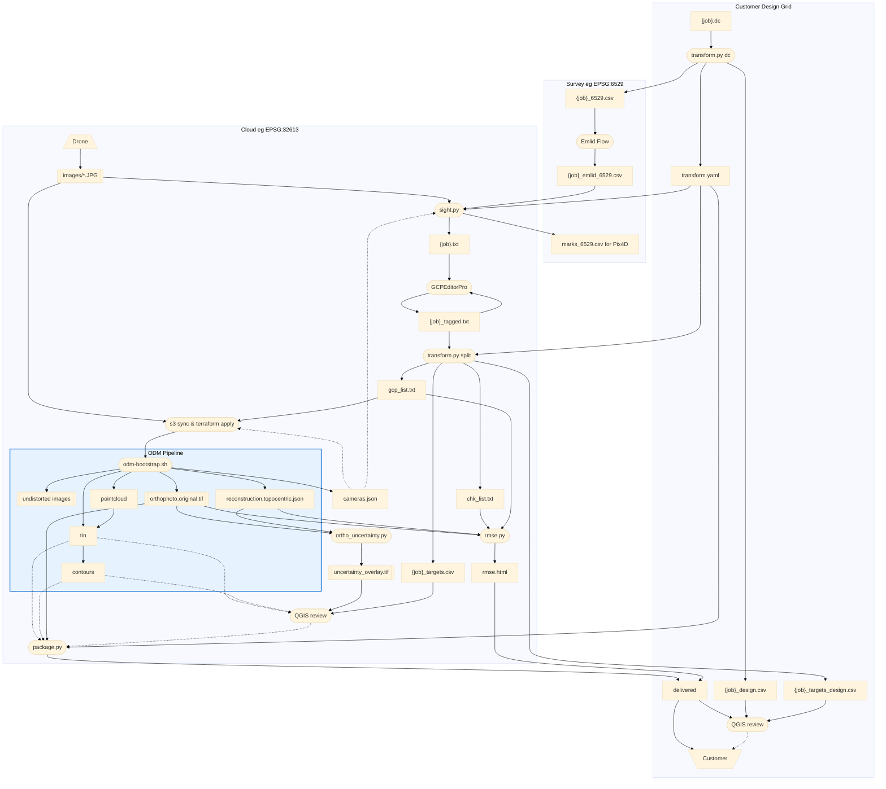

# Survey-Quality ODM Workflow

End-to-end process for producing survey-quality orthophotos with OpenDroneMap,
using Emlid GNSS survey data and GCPEditorPro pixel tagging.

---

## Overview


---

## Critical CRS rules

| CRS | Use | Notes |
|-----|-----|-------|
| **EPSG:32613** (WGS 84 / UTM 13N, metres) | ODM control + RMSE check files | **Always use this for ODM** |
| **EPSG:3618** (NAD83 NM Central, feet) | Field survey, internal analysis | CSV/QGIS only |
| **EPSG:6529** (NAD83(2011) NM Central, feet) | Emlid native output | Same zone as 3618; convert before ODM |

**Why EPSG:32613 for ODM?**  EPSG:3618 and 6529 are 2D — they define XY units (US
survey feet) but not vertical units.  ODM assumes Z is in metres for any 2D CRS,
causing a ~3.28× Z scale error when Z is in feet.  EPSG:32613 is unambiguous:
all axes in metres.  `transform.py` and `sight.py` handle the conversion automatically.

---

## Step-by-step

### 1. Obtain control monument coordinates

You need control monument coordinates in EPSG:3618 before going to the field.

**Customer/Trimble jobs**: Customer provides a `.dc` data collector file with design-grid
coordinates. `transform.py dc` converts them to state plane and writes
`{job}_6529.csv`, `{job}_design.csv`, and `transform.yaml`:

```bash
# Run without --anchor to see all control monuments in the .dc file, then pick one
# whose state-plane coords you can look up from the NGS database or client datasheet:
conda run -n geo python transform.py dc \
    ~/stratus/{job}/{customer}_{job}.dc

# Then re-run with the anchor:
conda run -n geo python transform.py dc \
    ~/stratus/{job}/{customer}_{job}.dc \
    --anchor <monument_id> <state_E_ft> <state_N_ft> \
    --out-dir ~/stratus/{job}/
# → ~/stratus/{job}/{job}_6529.csv    (state-plane EPSG:6529, for Emlid localization)
# → ~/stratus/{job}/{job}_design.csv  (design-grid coords, for QGIS design review)
# → ~/stratus/{job}/transform.yaml    (CRS + shift params; used downstream)

# Aztec job example (NGS monument 14, 'NGS VCM 3D Y 430', from NGS datasheet):
conda run -n geo python transform.py dc \
    ~/stratus/aztec/"F100340 AZTEC.dc" \
    --anchor 14 1147722.527 2144275.554 \
    --out-dir ~/stratus/aztec/
```

**How to identify the anchor monument:**

The customer provides a control sheet PDF alongside the `.dc` file.  The control sheet
lists all monuments with their design-grid coordinates and descriptions.  Monuments
labeled **"NGS"** (e.g. "NGS VCM 3D Y 430") are federally-published benchmarks with
official state-plane coordinates in the NGS database — these are the anchor candidates.

1. Run `transform.py dc <file.dc>` without `--anchor` to see the monument table.
   NGS candidates are flagged with `← NGS anchor candidate`.
2. Search the NGS datasheet database (https://www.ngs.noaa.gov/datasheets/) by monument
   description or by lat/lon near the project site.
3. Read the state-plane E/N in **US survey feet** from the datasheet.
4. Re-run with `--anchor <id> <state_E_ft> <state_N_ft>`.

The shift is saved in `transform.yaml` for all downstream steps.  It only needs to be
computed once per job (same `.dc` file = same design grid = same shift).

**Other jobs**: obtain monument coordinates in EPSG:3618 directly from the surveyor.

Use `{job}_points.csv` for Emlid RS3 base/rover localization in the field.

> **Before proceeding:** manually prune `{job}_6529.csv` (or the Emlid survey CSV)
> to remove any rows you do not want flowing through the pipeline — e.g. base-setup
> shots, observations from prior site visits, monuments not relevant to this job, or
> duplicate entries.  Every row that remains will become a candidate target in
> GCPEditorPro.  It is easiest to prune here, in a familiar spreadsheet format,
> before the data is transformed and projected.

### 2. Build tagging file

```bash
conda run -n geo python TargetSighter/sight.py \
    ~/stratus/{job}/{job}_surveyed_6529.csv \
    ~/stratus/{job}/images/
# If transform.yaml is present in ~/stratus/{job}/, sight.py auto-loads it:
#   field_crs → used as fallback CRS for the survey CSV
#   odm_crs   → target CRS for {job}.txt (EPSG:32613)
#   job name  → used as output filename ({job}.txt)
# Without transform.yaml, pass explicitly: --crs EPSG:XXXX --out-name "{job}"
# → ~/stratus/{job}/{job}.txt         (all survey points, EPSG:32613, for GCPEditorPro)
# → ~/stratus/{job}/marks_design.csv  (Pix4D parallel workflow — not used in ODM path)
```

sight.py assigns GCP-/CHK- label prefixes as **recommendations** based on the survey
CSV labels.  The user has final say on role assignment in GCPEditorPro (step 3).

### 3. Tag in GCPEditorPro

1. Open GCPEditorPro
2. Load **`{job}.txt`** and the images directory
3. Review each GCP- and CHK- point; tag pixel observations
   - GCP- labels = ground control (given to ODM to georeference the reconstruction)
   - CHK- labels = independent check points (withheld from ODM; used for accuracy QC only)
   - You may reassign labels between GCP- and CHK- roles as needed
4. Export → single "Download tagged file" button → saves as **`{job}_tagged.txt`**
   - All rows are exported (tagged and untagged)
   - Tagged observations have `tagged` in column 8; untagged have empty column 8

> `marks.csv` supports the parallel Pix4D workflow and is not used here.

### 4. Split into deliverable files

```bash
conda run -n geo python transform.py split \
    ~/stratus/{job}/{job}_tagged.txt \
    --out-dir ~/stratus/{job}/
# Reads ~/stratus/{job}/transform.yaml automatically
# → ~/stratus/{job}/gcp_list.txt            (GCP- tagged tuples, EPSG:32613; for ODM)
# → ~/stratus/{job}/chk_list.txt            (CHK- tagged tuples, EPSG:32613; for rmse.py)
# → ~/stratus/{job}/{job}_targets.csv       (one row/target, EPSG:32613; for QGIS review)
# → ~/stratus/{job}/{job}_targets_design.csv (one row/target, design-grid; for customer QGIS)
```

**`{job}_targets.csv`** is the primary QGIS QC layer: one row per surveyed target,
tagged targets labeled `GCP-NNN` or `CHK-NNN`, untagged targets labeled with bare
monument ID.  Load as a point layer over the orthophoto to verify target placement.

### 5. Launch ODM on EC2

```bash
# Upload images (one-time; skip if already in S3)
aws s3 sync ~/stratus/{job}/images/ \
    s3://stratus-jrstear/{PROJECT}/images/

# Upload control file
aws s3 cp ~/stratus/{job}/gcp_list.txt \
    s3://stratus-jrstear/{PROJECT}/gcp_list.txt

# Launch EC2 instance — pipeline starts automatically on boot
cd ~/git/geo/infra/ec2
terraform apply \
    --var="project={PROJECT}" \
    --var="notify_email=your@email.com"
```

Where `{PROJECT}` is the S3 prefix, e.g. `bsn/myjob`.

You will receive SNS emails as each stage completes, and on spot
interruption/resume events. The instance cancels its own spot request
and shuts down when the pipeline finishes.

Recommended ODM flags (set in `main.tf` `local.odm_flags`):
```
--pc-quality medium --feature-quality high --orthophoto-resolution 5 --dtm --dsm --dem-resolution 5 --cog --build-overviews
```

Expected runtime: ~20 hours on m5.4xlarge (16 vCPU). See `docs/cloud-infra-spec.md`.

**To destroy and resume on a fresh instance** (e.g. to pick up updated scripts/policies):

```bash
terraform destroy   # outputs already synced to S3 after each stage
terraform apply --var="project={PROJECT}" --var="notify_email=your@email.com"
# new instance syncs from S3 and resumes from the next incomplete stage
```

### 6. Verify accuracy with rmse.py

After the pipeline completes, sync the reconstruction down and run the check:

```bash
# Sync opensfm outputs from S3
aws s3 sync s3://stratus-jrstear/{PROJECT}/opensfm/ \
    ~/stratus/{job}/opensfm/

conda run -n geo python rmse.py \
    ~/stratus/{job}/opensfm/reconstruction.topocentric.json \
    ~/stratus/{job}/gcp_list.txt \
    ~/stratus/{job}/chk_list.txt
```

rmse.py triangulates each GCP/CHK target from camera rays in the reconstruction,
converts the topocentric position to the survey CRS via proper geodetic conversion
(ENU → ECEF → lat/lon → projected CRS, matching OpenSFM's `TopocentricConverter`),
and compares to the survey coordinates.  No similarity transform is fitted — the
proper geodetic conversion handles UTM grid convergence and scale factor correctly.

**Why `reconstruction.topocentric.json`:**

This file contains the GCP-constrained bundle adjustment result — camera orientations
refined to fit the survey control.  This is the "original" reconstruction before ODM's
`export_geocoords` converts it to projected coordinates.  Despite the name,
`reconstruction.json` is actually the *geocoords* version (post-export), not the raw
reconstruction.  rmse.py needs the topocentric version because it performs its own
geodetic conversion for accuracy assessment.

**Two types of accuracy:**

rmse.py reports **reconstruction accuracy** — how well the 3D reconstruction places
targets relative to their survey coordinates.  This is the accuracy of the camera
geometry and GCP constraints.

The **orthophoto accuracy** (where features appear in the deliverable) includes
additional error from DSM-based orthorectification.  Vegetation, DSM interpolation,
and off-nadir camera angles can shift features in the ortho by more than the
reconstruction accuracy would suggest.  Add `--html` and `--ortho` to generate a
visual accuracy report with annotated ortho crops:

```bash
conda run -n geo python rmse.py \
    ~/stratus/{job}/opensfm/reconstruction.topocentric.json \
    ~/stratus/{job}/gcp_list.txt \
    ~/stratus/{job}/chk_list.txt \
    --html ~/stratus/{job}/rmse_report.html \
    --ortho ~/stratus/{job}/odm_orthophoto/odm_orthophoto.original.tif
```

The HTML report includes summary tables (GCP + CHK), per-point residuals sorted
worst-first with an overview map, outlier detection, and annotated ortho crops
showing survey coordinates vs target positions.

Expected reconstruction accuracy (250 ft AGL, GCPs well-distributed):

| Component | Expected |
|-----------|----------|
| GCP RMS_H | 0.02–0.05 ft (control fit) |
| CHK RMS_H | 0.08–0.15 ft (independent) |
| CHK RMS_Z | 0.3–0.7 ft |

CHK residuals are the independent accuracy metric.  Orthophoto accuracy may be
0.3–1.0 ft larger depending on vegetation and camera angles at each target.

### 7. Deliver

```bash
# Sync deliverables from S3
aws s3 sync s3://stratus-jrstear/{PROJECT}/odm_orthophoto/ \
    ~/stratus/{job}/odm_orthophoto/
aws s3 sync s3://stratus-jrstear/{PROJECT}/odm_report/ \
    ~/stratus/{job}/odm_report/

# Package for customer delivery (reproject + shift to design grid + tile/COG)
# transform.yaml is auto-loaded from the same directory as the input TIF
python packager/package.py \
    --tif-file ~/stratus/{job}/odm_orthophoto/odm_orthophoto.original.tif \
    --transform-yaml ~/stratus/{job}/transform.yaml
# Or use the GUI: python packager/app.py → http://localhost:5001
```
