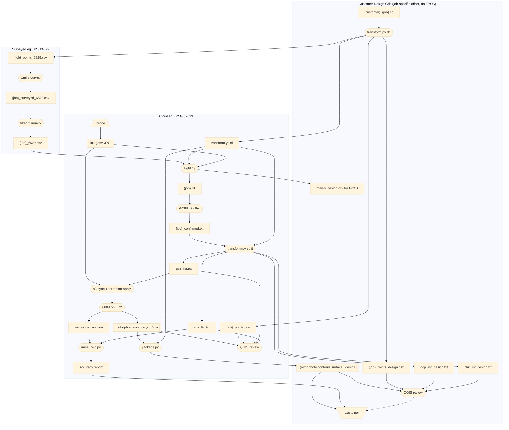

# Survey-Quality ODM Workflow

End-to-end process for producing survey-quality orthophotos with OpenDroneMap,
using Emlid GNSS survey data and GCPEditorPro pixel tagging.

---

## Overview


---

## Critical CRS rules

| CRS | Use | Notes |
|-----|-----|-------|
| **EPSG:32613** (WGS 84 / UTM 13N, metres) | ODM control + RMSE check files | **Always use this for ODM** |
| **EPSG:3618** (NAD83 NM Central, feet) | Field survey, internal analysis | CSV/QGIS only |
| **EPSG:6529** (NAD83(2011) NM Central, feet) | Emlid native output | Same zone as 3618; convert before ODM |

**Why EPSG:32613 for ODM?**  EPSG:3618 and 6529 are 2D — they define XY units (US
survey feet) but not vertical units.  ODM assumes Z is in metres for any 2D CRS,
causing a ~3.28× Z scale error when Z is in feet.  EPSG:32613 is unambiguous:
all axes in metres.  `convert_coords.py` handles the conversion automatically.

---

## Step-by-step

### 1. Obtain control monument coordinates

You need control monument coordinates in EPSG:3618 before going to the field.

**Customer/Trimble jobs**: Customer provides a `.dc` data collector file with design-grid
coordinates. `transform.py dc` converts them to state plane and writes
`{job}_points.csv` + `transform.yaml` (CRS and shift parameters for the job):

```bash
conda run -n geo python transform.py dc \
    ~/stratus/{job}/{customer}_{job}.dc \
    --shift-x <design_E - state_E>  --shift-y <design_N - state_N> \
    --out-dir ~/stratus/{job}/
# → ~/stratus/{job}/{job}_points.csv   (state-plane, EPSG auto-detected from .dc)
# → ~/stratus/{job}/transform.yaml     (CRS + shift params; used by transform.py split)
```

The shift values are job-specific (derived once from a known monument).

**Other jobs**: obtain monument coordinates in EPSG:3618 directly from the surveyor.

Use `{job}_points.csv` for Emlid RS3 base/rover localization in the field.

### 2. Build tagging file

```bash
conda run -n geo python TargetSighter/sight.py \
    ~/stratus/{job}/{job}.csv \
    ~/stratus/{job}/images/
# If transform.yaml is present in ~/stratus/{job}/, sight.py auto-loads it:
#   field_crs → used as fallback CRS for the survey CSV
#   job name  → used as output filename ({job}.txt)
# Without transform.yaml, pass explicitly: --crs EPSG:XXXX --out-name "{job}"
# → ~/stratus/{job}/{job}.txt    (for input to GCPEditorPro)
# → ~/stratus/{job}/marks.csv   (Pix4D parallel workflow — not used in ODM path)
```

### 3. Tag and confirm in GCPEditorPro

1. Open GCPEditorPro
2. Load **`{job}.txt`** and the images directory
3. Review each GCP- and CHK- point; confirm observations
4. Export → save as **`~/stratus/{job}/{job}_confirmed.txt`**

GCP- labels = ground control (given to ODM to georeference the reconstruction)
CHK- labels = independent check points (withheld from ODM; used for accuracy QC only)

> `marks.csv` supports the parallel Pix4D workflow and is not used here.

### 4. Split into control + check files

```bash
conda run -n geo python transform.py split \
    ~/stratus/{job}/{job}_confirmed.txt \
    --out-dir ~/stratus/{job}/
# Reads ~/stratus/{job}/transform.yaml for field_crs automatically
# → ~/stratus/{job}/gcp_list.txt   (GCP- only, EPSG:32613)
# → ~/stratus/{job}/chk_list.txt   (CHK- only, EPSG:32613)
```

### 5. Launch ODM on EC2

```bash
# Upload images (one-time; skip if already in S3)
aws s3 sync ~/stratus/{job}/images/ \
    s3://stratus-jrstear/{PROJECT}/images/ \
    --profile personal

# Upload control file
aws s3 cp ~/stratus/{job}/gcp_list.txt \
    s3://stratus-jrstear/{PROJECT}/gcp_list.txt \
    --profile personal

# Launch EC2 instance — pipeline starts automatically on boot
cd ~/git/geo/infra/ec2
terraform apply \
    --var="project={PROJECT}" \
    --var="notify_email=your@email.com"
```

Where `{PROJECT}` is the S3 prefix, e.g. `bsn/myjob`.

You will receive SNS emails as each stage completes, and on spot
interruption/resume events. The instance cancels its own spot request
and shuts down when the pipeline finishes.

Recommended ODM flags (set in `main.tf` `local.odm_flags`):
```
--pc-quality medium --feature-quality high --orthophoto-resolution 5 --optimize-disk-space
```

Expected runtime: ~20 hours on m5.4xlarge (16 vCPU). See `docs/cloud-infra-spec.md`.

**To destroy and resume on a fresh instance** (e.g. to pick up updated scripts/policies):

```bash
terraform destroy   # outputs already synced to S3 after each stage
terraform apply --var="project={PROJECT}" --var="notify_email=your@email.com"
# new instance syncs from S3 and resumes from the next incomplete stage
```

### 6. Verify accuracy with rmse_calc.py

After the pipeline completes, sync the reconstruction down and run the check:

```bash
# Sync opensfm outputs from S3
aws s3 sync s3://stratus-jrstear/{PROJECT}/opensfm/ \
    ~/stratus/{job}/opensfm/ \
    --profile personal

# Run RMSE analysis
conda run -n geo python TargetSighter/rmse_calc.py \
    ~/stratus/{job}/opensfm/reconstruction.json \
    ~/stratus/{job}/chk_list.txt
```

Expected accuracy (250 ft AGL, drone RTK active, 5 Customer monument GCPs):

| Component | Expected |
|-----------|----------|
| Horizontal RMS | 0.08–0.12 ft (0.024–0.037 m) |
| Vertical RMS | 0.12–0.18 ft (0.037–0.055 m) |

RMS_Z mean offset is typically near zero — the check file Z is in ellipsoidal metres
(written by `convert_coords.py`), consistent with ODM's internal reference. The std_dZ
is the true vertical accuracy metric.

### 7. Deliver

```bash
# Sync deliverables from S3
aws s3 sync s3://stratus-jrstear/{PROJECT}/odm_orthophoto/ \
    ~/stratus/{job}/odm_orthophoto/ --profile personal
aws s3 sync s3://stratus-jrstear/{PROJECT}/odm_report/ \
    ~/stratus/{job}/odm_report/ --profile personal

# Package for customer delivery (reproject + shift to design grid + tile/COG)
# transform.yaml is auto-loaded from the same directory as the input TIF
python package.py \
    --tif-file ~/stratus/{job}/odm_orthophoto/odm_orthophoto.original.tif \
    --transform-yaml ~/stratus/{job}/transform.yaml
# Or use the GUI: python app.py → http://localhost:5001
```

