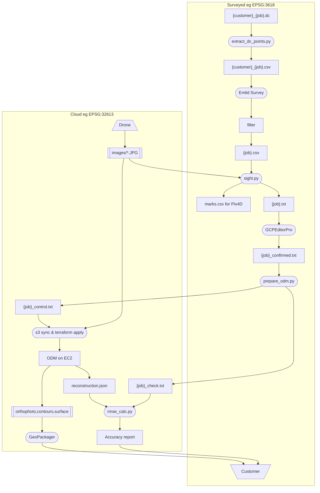

# Survey-Quality ODM Workflow

End-to-end process for producing survey-quality orthophotos with OpenDroneMap,
using Emlid GNSS survey data and GCPEditorPro pixel tagging.

---

## Overview


---

## File naming convention
All of these files should be in a {job} folder (eg ~/stratus/aztec/)

| Stage | File | Location |
|-------|------|----------|
| customer | `{job}_all.dc` | from customer |
| Emlid survey | `{job}_all.csv` | all points, Emlid Flow export |
| Pipeline input | `{job}_filtered.csv` | subset for tagging |
| Tagging file | `{job}.txt` | csv2gcp.py output for GCPEditorPro |
| GCPEditorPro export | `{job}_confirmed.txt` | all confirmed (GCP- + CHK-) |
| ODM control | `{job}_control.txt` | GCP- only |
| RMSE check | `{job}_check.txt` | CHK- only |

**Do not use `gcp_list.txt`** as a working filename — it is only used as the
S3/EC2 handoff name expected by `odm-bootstrap.sh`.

---

## Critical CRS rules

| CRS | Use | Notes |
|-----|-----|-------|
| **EPSG:32613** (WGS 84 / UTM 13N, metres) | ODM control + RMSE check files | **Always use this for ODM** |
| **EPSG:3618** (NAD83 NM Central, feet) | Field survey, internal analysis | CSV/QGIS only |
| **EPSG:6529** (NAD83(2011) NM Central, feet) | Emlid native output | Same zone as 3618; convert before ODM |

**Why EPSG:32613 for ODM?**  EPSG:3618 and 6529 are 2D — they define XY units (US
survey feet) but not vertical units.  ODM assumes Z is in metres for any 2D CRS,
causing a ~3.28× Z scale error when Z is in feet.  EPSG:32613 is unambiguous:
all axes in metres.  `prepare_odm.py` handles the conversion automatically.

---

## Step-by-step

### 1. Obtain control monument coordinates

You need control monument coordinates in EPSG:3618 before going to the field.

**BSN/Trimble jobs**: BSN provides a `.dc` data collector file with design-grid
coordinates. A job-specific extraction script (e.g.
`~/stratus/{job}/python/extract_dc_points.py`) converts them to state plane
EPSG:3618 and writes `{job}_points.csv`.  See `~/stratus/aztec/jrs/Control_Info_F100340_AZTEC.md`
for how the offset was derived for the Aztec job.

**Other jobs**: obtain monument coordinates in EPSG:3618 directly from the surveyor.

Use `{job}_points.csv` for Emlid RS3 base/rover localization in the field.

### 2. Build tagging file

```bash
conda run -n geo python GCPSighter/csv2gcp.py \
    ~/stratus/{job}/{job}_filtered.csv \
    ~/stratus/{job}/images/ \
    --out-name "{job}"
# → ~/stratus/{job}/{job}.txt    (for input to GCPEditorPro)
# → ~/stratus/{job}/marks.csv   (Pix4D parallel workflow — not used in ODM path)
```

### 3. Tag and confirm in GCPEditorPro

1. Open GCPEditorPro
2. Load **`{job}.txt`** and the images directory
3. Review each GCP- and CHK- point; confirm observations
4. Export → save as **`~/stratus/{job}/{job}_confirmed.txt`**

GCP- labels = ground control (given to ODM to georeference the reconstruction)
CHK- labels = independent check points (withheld from ODM; used for accuracy QC only)

> `marks.csv` supports the parallel Pix4D workflow and is not used here.

### 4. Split into control + check files

```bash
conda run -n geo python GCPSighter/prepare_odm.py \
    ~/stratus/{job}/{job}_confirmed.txt \
    --out-dir ~/stratus/{job}/ \
    --stem {job}
# → ~/stratus/{job}/{job}_control.txt   (GCP- only, EPSG:32613)
# → ~/stratus/{job}/{job}_check.txt     (CHK- only, EPSG:32613)
```

### 5. Launch ODM on EC2

```bash
# Upload images (one-time; skip if already in S3)
aws s3 sync ~/stratus/{job}/images/ \
    s3://stratus-jrstear/{PROJECT}/images/ \
    --profile personal

# Upload control file as gcp_list.txt (the name bootstrap.sh expects)
aws s3 cp ~/stratus/{job}/{job}_control.txt \
    s3://stratus-jrstear/{PROJECT}/gcp_list.txt \
    --profile personal

# Launch EC2 instance — pipeline starts automatically on boot
cd ~/git/geo/infra/ec2
terraform apply \
    --var="project={PROJECT}" \
    --var="notify_email=your@email.com"
```

Where `{PROJECT}` is the S3 prefix, e.g. `bsn/aztec3`.

You will receive SNS emails as each stage completes, and on spot
interruption/resume events. The instance cancels its own spot request
and shuts down when the pipeline finishes.

Recommended ODM flags (set in `main.tf` `local.odm_flags`):
```
--pc-quality medium --feature-quality high --orthophoto-resolution 5 --optimize-disk-space
```

Expected runtime: ~20 hours on m5.4xlarge (16 vCPU). See `docs/cloud-infra-spec.md`.

**To destroy and resume on a fresh instance** (e.g. to pick up updated scripts/policies):

```bash
terraform destroy   # outputs already synced to S3 after each stage
terraform apply --var="project={PROJECT}" --var="notify_email=your@email.com"
# new instance syncs from S3 and resumes from the next incomplete stage
```

### 6. Verify accuracy with rmse_calc.py

After the pipeline completes, sync the reconstruction down and run the check:

```bash
# Sync opensfm outputs from S3
aws s3 sync s3://stratus-jrstear/{PROJECT}/opensfm/ \
    ~/stratus/{job}/opensfm/ \
    --profile personal

# Run RMSE analysis
conda run -n geo python GCPSighter/rmse_calc.py \
    ~/stratus/{job}/opensfm/reconstruction.json \
    ~/stratus/{job}/{job}_check.txt \
    ~/stratus/{job}/{job}_filtered.csv
```

Expected accuracy (250 ft AGL, drone RTK active, 5 BSN monument GCPs):

| Component | Expected |
|-----------|----------|
| Horizontal RMS | 0.08–0.12 ft (0.024–0.037 m) |
| Vertical RMS | 0.12–0.18 ft (0.037–0.055 m) |

RMS_Z will show a small systematic offset (~geoid separation, ~24 m) which is normal —
ODM works in ellipsoidal height internally. The residual *variation* around that offset
is the accuracy metric. If RMS_Z is near 4,000 m, the Z unit conversion was not applied.

### 7. Deliver

```bash
# Sync orthophoto and report from S3
aws s3 sync s3://stratus-jrstear/{PROJECT}/odm_orthophoto/ \
    ~/stratus/{job}/odm_orthophoto/ --profile personal
aws s3 sync s3://stratus-jrstear/{PROJECT}/odm_report/ \
    ~/stratus/{job}/odm_report/ --profile personal

# Reproject to state plane (optional — QGIS handles on-the-fly)
gdalwarp -s_srs EPSG:32613 -t_srs EPSG:3618 odm_orthophoto.tif ortho_3618.tif

# Apply BSN design-grid shift for delivery (Aztec job only)
python package.py \
    --no-tile \
    --shift-x 1546702.929 \
    --shift-y -3567.471 \
    ortho_3618.tif
```

---

## Aztec Highway F100340 — specific notes

- Survey CSV: `~/stratus/aztec/Aztec Highway 3_9.csv` (filtered 3/9 points)
- Confirmed file: `~/stratus/aztec/gcp_list.txt` (historical name; the `_confirmed.txt` equivalent)
- aztec3 control: `~/stratus/aztec3/aztec_control.txt` → S3 as `bsn/aztec3/gcp_list.txt`
- aztec3 check: `~/stratus/aztec3/aztec_check.txt`
- Design-grid shift: state_E + 1,546,702.929 ft; state_N − 3,567.471 ft
- CRS detail: see `~/stratus/aztec/jrs/Control_Info_F100340_AZTEC.md`
- Prior run issues: see `~/stratus/aztec/jrs/ortho-analysis.md`

### GCP distribution (corridor)

10 GCPs for a 1385-image corridor are marginal. Recommended distribution:
- Alternating sides of road every ~500 ft
- GCPs at both ends + 2 mid-corridor
- Z-critical points at high/low elevation extremes
- CHK points distributed throughout (not clustered near GCPs)

See `docs/aztec-gcp-analysis.md` for full placement analysis.
