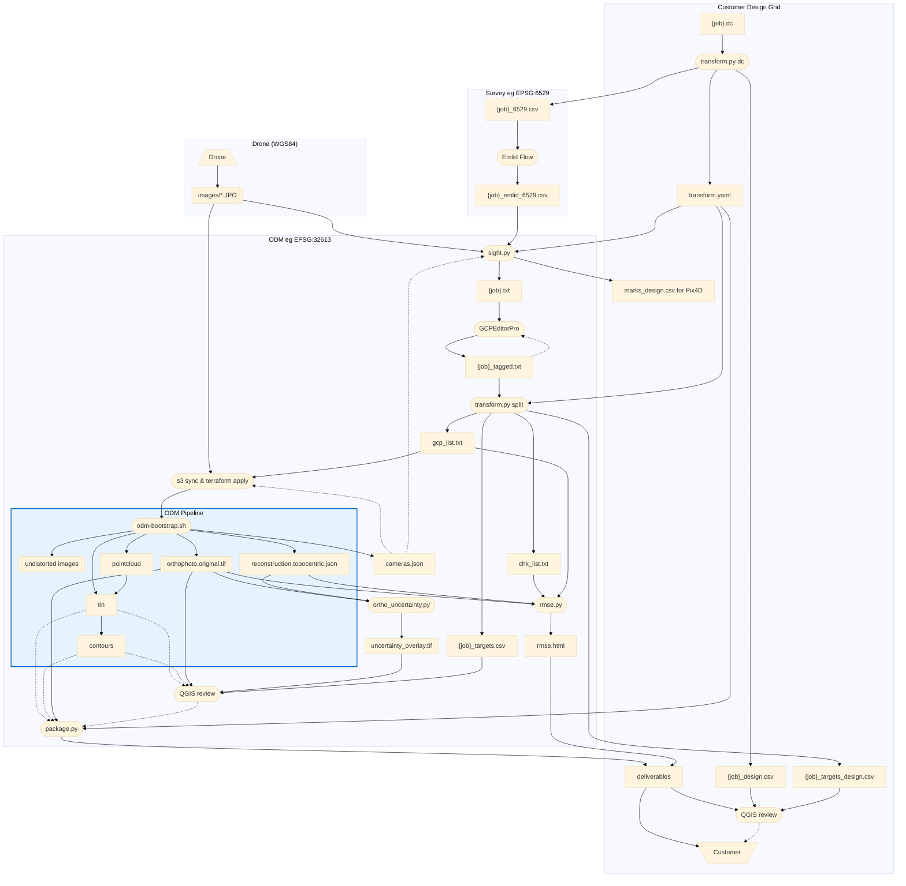

# Survey-Quality ODM Workflow

End-to-end process for producing survey-quality orthophotos with OpenDroneMap,
using Emlid GNSS survey data and GCPEditorPro pixel tagging.

---

## Overview


### Edge Notes

Dotted edges signify a) recycled or iterative (eg cameras.json and {job}\_tagged.txt), b) decision (eg QGIS review before package.py or customer delivery), or c) not done yet (tin and contours).

---

## CRS notes

Subgraphs in the workflow diagram show distinct coordinate systems, here are some related comments.

| CRS | Use | Notes |
|-----|-----|-------|
| **EPSG:32613** (WGS 84 / UTM 13N, metres) | ODM control + RMSE check files | **Always use this for ODM** |
| **EPSG:6529** (NAD83(2011) NM Central, ftUS) | Field survey, Emlid native output, internal analysis | Convert before ODM |

**Note on EPSG:3618 vs 6529:** Both are NAD83 NM Central in US survey feet for the same zone.
The difference is the realization year (1986 vs 2011); horizontal coordinates differ by only
a fraction of a foot regionally and are interchangeable for this workflow.  We use 6529
throughout because it is the Emlid native output.

**Why EPSG:32613 for ODM?**  EPSG:6529 is 2D — it defines XY units (US survey
feet) but not vertical units.  ODM assumes Z is in metres for any 2D CRS,
causing a ~3.28× Z scale error when Z is in feet.  EPSG:32613 is unambiguous:
all axes in metres.  `transform.py` and `sight.py` handle the conversion automatically.

---

## Workflow step-by-step

### 1. Obtain control monument coordinates

You need control monument coordinates in EPSG:6529 before going to the field.

**Customer/Trimble jobs**: Customer provides a `.dc` data collector file with design-grid
coordinates. `transform.py dc` converts them to state plane and writes
`{job}_6529.csv`, `{job}_design.csv`, and `transform.yaml`:

```bash
# Default: auto-query the NGS API to identify anchor monuments and compute the shift.
conda run -n geo python transform.py dc \
    ~/stratus/{job}/{customer}_{job}.dc \
    --out-dir ~/stratus/{job}/
# → ~/stratus/{job}/{job}_6529.csv    (state-plane EPSG:6529, for Emlid localization)
# → ~/stratus/{job}/{job}_design.csv  (design-grid coords, for QGIS design review)
# → ~/stratus/{job}/transform.yaml    (CRS + shift params; used downstream)

# Manual override (when NGS auto-lookup fails or you need higher accuracy than the
# lat/lon-derived fallback ±20 ft):
conda run -n geo python transform.py dc \
    ~/stratus/aztec/"F100340 AZTEC.dc" \
    --anchor 14 1147722.527 2144275.554 \
    --out-dir ~/stratus/aztec/
```

**How the anchor is identified:**

`transform.py dc` first tries the NGS API automatically — for any control monument in
the `.dc` file described as an NGS benchmark (e.g. "NGS VCM 3D Y 430"), it queries the
NGS datasheet database, retrieves the official state-plane coordinates, and computes the
design-grid shift.  When multiple NGS anchors are present, the script cross-checks them
and prints how closely they agree (typically within a fraction of a foot).  For most
jobs no manual lookup is needed.

If auto-lookup fails (no NGS-described monuments in the file, or the API returns no
matches), the script prints the monument table — flagging NGS candidates with `← NGS` —
and exits.  In that case:

1. Search the NGS datasheet database (https://www.ngs.noaa.gov/datasheets/) by monument
   description or by lat/lon near the project site.
2. Read the state-plane E/N in **US survey feet** from the datasheet.
3. Re-run with `--anchor <id> <state_E_ft> <state_N_ft>`.

You may also use `--anchor` to override the API result when you need tighter accuracy
than the API's lat/lon-derived fallback (~±20 ft) provides.

The shift is saved in `transform.yaml` for consistent reuse downstream.  It only needs to be
computed once per job (same `.dc` file = same design grid = same shift).

**Other jobs**: obtain monument coordinates in EPSG:6529 directly from the surveyor.

Use `{job}_6529.csv` for Emlid RS3 base/rover localization in the field.

> **Before proceeding:** manually prune `{job}_6529.csv` (or the Emlid survey CSV)
> to remove any rows you do not want flowing through the pipeline — e.g. base-setup
> shots, observations from prior site visits, monuments not relevant to this job, or
> duplicate entries.  Every row that remains will become a candidate target in
> GCPEditorPro.  It is easiest to prune here, in a familiar spreadsheet format,
> before the data is transformed and projected.

### 2. Build tagging file

```bash
conda run -n geo python TargetSighter/sight.py \
    ~/stratus/{job}/{job}_emlid_6529.csv \
    ~/stratus/{job}/images/
# If transform.yaml is present in ~/stratus/{job}/, sight.py auto-loads it:
#   field_crs → used as fallback CRS for the survey CSV
#   odm_crs   → target CRS for {job}.txt (EPSG:32613)
#   job name  → used as output filename ({job}.txt)
# Without transform.yaml, pass explicitly: --crs EPSG:XXXX --out-name "{job}"
# → ~/stratus/{job}/{job}.txt         (all survey points, EPSG:32613, for GCPEditorPro)
# → ~/stratus/{job}/marks_design.csv  (Pix4D parallel workflow — not used in ODM path)
```

By default, sight.py names the ten most-dispersed targets as GCP and the remainder as CHK, then ranks the targets and their images by tagging value — tagging in order produces the best accuracy for the least effort. Near-duplicate targets (within `--dup-tolerance` metres of another, default 1 m) inherit the role of their closest primary and get a `-dup` suffix (`GCP-104-dup`, `CHK-119-dup2`, ...), and are placed immediately after their primary in the file so they can be reviewed side-by-side. Target names are **recommendations** — the user has final say on role assignment in GCPEditorPro (step 3).

**How sight.py orders targets** — the sequence is designed to lock down the
model's geometry as quickly as possible with the fewest tags:

| Order | GCP selected as | Why first |
|-------|-----------------|-----------|
| 1st | Most distal from centroid | Sets one anchor of the bounding box |
| 2nd | Most distal from #1 | Defines global scale and orientation |
| 3rd | Highest elevation *(hilly sites only)* | Prevents vertical drift upward |
| 4th | Lowest elevation *(hilly sites only)* | Prevents vertical drift downward |
| 5th | Closest to centroid | Anti-doming center pin |
| 6th–10th | Remaining, perimeter-first | Redundancy — strongest structural value |
| 11th+ | Remaining, interior-first | Become CHK- check points |

Z-priority slots (3rd and 4th) activate only when the site's elevation range
exceeds 5 % of the horizontal span (`--z-threshold`).  Flat sites skip from
2nd directly to the center pin.

Within each target, **images are sorted by confidence** — well-centred shots
(less lens distortion) before edge shots, with nadir and oblique images
interleaved so that the first 7 contain both nadir coverage (accurate X/Y) and
oblique coverage (parallax for accurate Z).  Use `--nadir-weight` to tune how
aggressively obliques are promoted (default 0.2; higher values push obliques
later in the list).

**Common sight.py flags:**

| Flag | Effect |
|------|--------|
| `--no-sort` | Output targets in input CSV order, images in match order (let upstream control ordering) |
| `--no-coloredX` | Disable Stage-3 color-based marker refinement (runs by default; needs cv2/numpy) |
| `--n-control 7` | How many top targets become GCP- (default 10) |
| `--z-threshold 0.02` | Lower threshold to activate Z-priority slots on modest terrain (default 0.05) |
| `--nadir-weight 0.4` | Tune oblique/nadir interleaving (0 = treat equally, 1 = all nadir first; default 0.2) |
| `--reconstruction path/to/reconstruction.json` | Use SfM-refined camera poses for ±5–20 px estimates instead of EXIF-only ±30–150 px (requires a prior ODM run) |

### 3. Tag in GCPEditorPro

This step uses a [GCPEditorPro fork](https://github.com/jrstear/GCPEditorPro/tree/feature/auto-gcp-pipeline)
with pipeline-aware features (zoom view, spacebar confirm, progress badges,
compass/tilt overlays, etc.). The full list of modifications relative to
upstream uav4geo/GCPEditorPro lives in the fork itself:
[`CHANGES-fork.md`](https://github.com/jrstear/GCPEditorPro/blob/feature/auto-gcp-pipeline/CHANGES-fork.md).

1. Open GCPEditorPro.  Running from source (this fork on
   `feature/auto-gcp-pipeline`) requires the OpenSSL legacy provider:
   ```bash
   cd ~/git/GCPEditorPro && NODE_OPTIONS=--openssl-legacy-provider npm start
   ```
   The app opens at <http://localhost:4200>.
2. Load **`{job}.txt`** and the images directory
3. Review GCP- and CHK- points, tag pixel observations
   - GCP- labels = ground control (given to ODM to georeference the reconstruction)
   - CHK- labels = independent check points (withheld from ODM; used for accuracy QC only)
   - You may reassign labels between GCP- and CHK- roles as needed (select in target list, then toggle the Checkpoint checkbox).
4. Go to next step → Download → saves as **`{job}_tagged.txt`**
   - All rows are exported (tagged and untagged)

**Tagging targets (USGS / ASPRS):**

| Requirement | Minimum | Target |
|---|---|---|
| GCP- control points confirmed | 3 | **7** (of 10 candidates) |
| CHK- check points confirmed | 3 | **7** |
| Confirmed images per GCP-/CHK- point | 3 | **7** |

The minimums are hard floors from the *USGS National Geospatial Program — Lidar
Base Specification* and *ASPRS Positional Accuracy Standards for Digital
Geospatial Data (2015)*; both specify ≥ 3 independent check points for
publishable accuracy reporting.  The "target 7" values match the green-badge
threshold in GCPEditorPro's progress indicators.  Work top-to-bottom through
the list — sight.py's ordering means the first 7 give the best structural
coverage for the least effort.

### 4. Split into deliverable files

```bash
conda run -n geo python transform.py split \
    ~/stratus/{job}/{job}_tagged.txt \
    --out-dir ~/stratus/{job}/
# Reads ~/stratus/{job}/transform.yaml automatically
# → ~/stratus/{job}/gcp_list.txt            (GCP- tagged tuples, EPSG:32613; for ODM)
# → ~/stratus/{job}/chk_list.txt            (CHK- tagged tuples, EPSG:32613; for rmse.py)
# → ~/stratus/{job}/{job}_targets.csv       (one row/target, EPSG:32613; for QGIS review)
# → ~/stratus/{job}/{job}_targets_design.csv (one row/target, design-grid; for customer QGIS)
```

**`{job}_targets.csv`** is the primary QGIS QC layer: one row per surveyed target,
tagged targets labeled `GCP-NNN` or `CHK-NNN`, untagged targets labeled with bare
monument ID.  Load as a point layer over the orthophoto to verify target placement.

### 5. Launch ODM on EC2

```bash
# Upload images (one-time; skip if already in S3)
aws s3 sync ~/stratus/{job}/images/ \
    s3://stratus-jrstear/{PROJECT}/images/

# Upload control file
aws s3 cp ~/stratus/{job}/gcp_list.txt \
    s3://stratus-jrstear/{PROJECT}/gcp_list.txt

# Launch EC2 instance — pipeline starts automatically on boot
cd ~/git/geo/infra/ec2
terraform apply \
    -var="project={PROJECT}" \
    -var="notify_email=your@email.com"
```

Where `{PROJECT}` is the S3 prefix, e.g. `bsn/myjob`.

You will receive SNS emails as each stage completes, and on spot
interruption/resume events. The instance cancels its own spot request
and shuts down when the pipeline finishes.

Recommended ODM flags (set in `main.tf` `local.odm_flags`):
```
--pc-quality medium --feature-quality high --orthophoto-resolution 5 --dtm --dsm --dem-resolution 5 --cog --build-overviews
```

**To destroy and resume on a fresh instance** (e.g. to pick up updated scripts/policies):

```bash
terraform destroy   # outputs already synced to S3 after each stage
terraform apply -var="project={PROJECT}" -var="notify_email=your@email.com"
# new instance syncs from S3 and resumes from the next incomplete stage
```

### 6. Verify accuracy with rmse.py

After the pipeline completes, sync the reconstruction down and run the check:

```bash
# Sync opensfm outputs from S3
aws s3 sync s3://stratus-jrstear/{PROJECT}/opensfm/ \
    ~/stratus/{job}/opensfm/

conda run -n geo python rmse.py \
    ~/stratus/{job}/opensfm/reconstruction.topocentric.json \
    ~/stratus/{job}/gcp_list.txt \
    ~/stratus/{job}/chk_list.txt
```

rmse.py triangulates each GCP/CHK target from camera rays in the reconstruction,
converts the topocentric position to the survey CRS via proper geodetic conversion
(ENU → ECEF → lat/lon → projected CRS, matching OpenSFM's `TopocentricConverter`),
and compares to the survey coordinates.  No similarity transform is fitted — the
proper geodetic conversion handles UTM grid convergence and scale factor correctly.

**Why `reconstruction.topocentric.json`:**

This file contains the GCP-constrained bundle adjustment result — camera orientations
refined to fit the survey control.  This is the "original" reconstruction before ODM's
`export_geocoords` converts it to projected coordinates.  Despite the name,
`reconstruction.json` is actually the *geocoords* version (post-export), not the raw
reconstruction.  rmse.py needs the topocentric version because it performs its own
geodetic conversion for accuracy assessment.

**Two types of accuracy:**

rmse.py reports **reconstruction accuracy** — how well the 3D reconstruction places
targets relative to their survey coordinates.  This is the accuracy of the camera
geometry and GCP constraints.

The **orthophoto accuracy** (where features appear in the deliverable) includes
additional error from DSM-based orthorectification.  Vegetation, DSM interpolation,
and off-nadir camera angles can shift features in the ortho by more than the
reconstruction accuracy would suggest.  Add `--html` and `--ortho` to generate a
visual accuracy report with annotated ortho crops:

```bash
conda run -n geo python rmse.py \
    ~/stratus/{job}/opensfm/reconstruction.topocentric.json \
    ~/stratus/{job}/gcp_list.txt \
    ~/stratus/{job}/chk_list.txt \
    --html ~/stratus/{job}/rmse_report.html \
    --ortho ~/stratus/{job}/odm_orthophoto/odm_orthophoto.original.tif
```

The HTML report includes summary tables (GCP + CHK), per-point residuals sorted
worst-first with an overview map, outlier detection, and annotated ortho crops
showing survey coordinates vs target positions.

Expected reconstruction accuracy (250 ft AGL, RTK, GCPs well-distributed):

| Component | Expected |
|-----------|----------|
| GCP RMS_H | 0.02–0.05 ft (control fit) |
| CHK RMS_H | 0.08–0.15 ft (independent) |
| CHK RMS_Z | 0.3–0.7 ft |

CHK residuals are the independent accuracy metric.  Orthophoto accuracy may be
0.3–1.0 ft larger depending on vegetation and camera angles at each target.

If you have run `ortho_uncertainty.py` (see diagram) to produce a per-pixel uncertainty
overlay TIF, pass it via `--uncertainty` to embed it at the end of the HTML report:

```bash
conda run -n geo python rmse.py \
    ~/stratus/{job}/opensfm/reconstruction.topocentric.json \
    ~/stratus/{job}/gcp_list.txt \
    ~/stratus/{job}/chk_list.txt \
    --html ~/stratus/{job}/rmse_report.html \
    --ortho ~/stratus/{job}/odm_orthophoto/odm_orthophoto.original.tif \
    --uncertainty ~/stratus/{job}/uncertainty_overlay.tif
```

This combines the point-wise residual report with a spatial view of where the
reconstruction is least confident — useful for spotting regions where the orthophoto
accuracy is likely to depart most from the CHK residual statistics.

### 7. Package

```bash
# Sync deliverables from S3
aws s3 sync s3://stratus-jrstear/{PROJECT}/odm_orthophoto/ \
    ~/stratus/{job}/odm_orthophoto/
aws s3 sync s3://stratus-jrstear/{PROJECT}/odm_report/ \
    ~/stratus/{job}/odm_report/

# Package for customer delivery (reproject + shift to design grid + tile/COG)
# transform.yaml is auto-loaded from the same directory as the input TIF
python packager/package.py \
    --tif-file ~/stratus/{job}/odm_orthophoto/odm_orthophoto.original.tif \
    --transform-yaml ~/stratus/{job}/transform.yaml
# Or use the GUI via python packager/app.py
```

### 8. Review and deliver
Use QGIS to review deliverables in cloud and/or design coordinates, deliver when ready.
